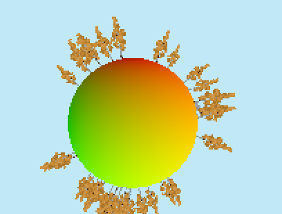
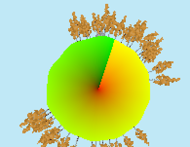
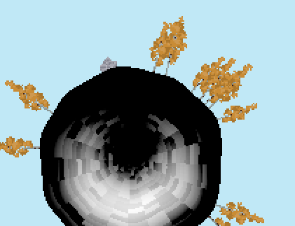
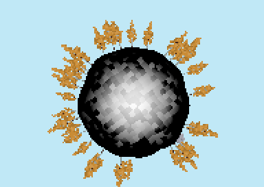
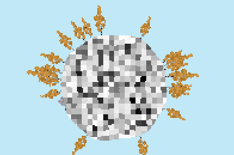
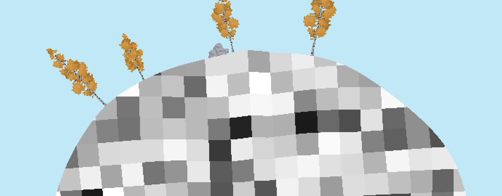
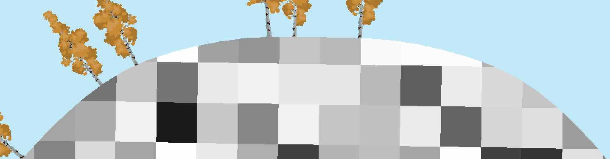
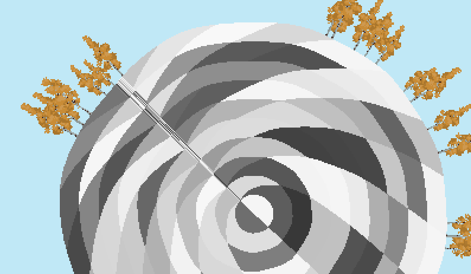

# Här står allting om spelet och hur allting fungerar etc.

## Keybinds
Klicka Q, W eller E för att välja en tile (esc om du vill sluta) och klicka med musen för att sätta ner den. Du kan snurra runt planeten med A&D. Du kan scrolla för att zooma ut (fungerar inte så bra just nu) och klicka backspace (eller delete tror jag på windows) om du vill resetta scroll.

## Planeter
Eftersom själva idéen med spelet är att det ska finnas som ett solsystem med flera olika planeter, som spelare kan bosätta, så måste det finnas ett sätt att veta vems planet är vems. Just nu har jag gjort så att den spelare som spelar får en planet med component `PlayerPlanet`. Alltså kan man querya `&Planet, With<PlayerPlanet>` för att få info m.m. om den planeten som spelaren själv använder.

Eftersom varje planet är rund, så sparar jag inte koordinater för alla olika tiles (ex solceller), utan jag sparar dess "vinkel index". Varje tile:s position kan beräknas av deras vinkel och radien av planeten. Men för att göra så att bara en tile kan lägga sig på samma ställe har jag gjort så att varje vinkel som kan tas upp på en planet "snapar" till närmsta multipel av `PLANET_ANGULAR_STEP` (får plats med en `TILE_WIDTH` varje ny vinkel). Sen gör jag om det till en index, alltså 0rad = index 0, 0rad + `PLANET_ANGULAR_STEP` = index 1, 0rad + 2 * `PLANET_ANGULAR_STEP` = index 2 osv. Då kan man kolla om en vinkel är upptagen.

Men vad är en tile? En tile kan man sätta ut på planeter och kan exempelvis lagra energi, utsändra energi (solceller) m.m. En tile kan ha en `CableSlot` i sig, en cable slot är alltså en sorts tile som man kan sätta kablar till och från. Solceller har en cable slot, eftersom dom ska kunna fördela ut energi.

half_angle: angle.to_radians() / 2.0,

-----

// Push the center of the circle.
uvs.push([0.5; 2]);

let first_angle = FRAC_PI_2 - self.sector.half_angle();
let last_angle = FRAC_PI_2 + self.sector.half_angle();
let last_i = (self.resolution - 1) as f32;

for i in 0..self.resolution {
    let angle = f32::lerp(first_angle, last_angle, i as f32 / last_i);

    // Compute the UV coordinate by taking the modified angle's unit vector, negating the Y axis, and rescaling and centering it at (0.5, 0.5).
    // We accomplish the Y axis flip by negating the angle.
    let uv =
        Vec2::from_angle(-(angle + uv_angle)).mul_add(Vec2::splat(0.5), Vec2::splat(0.5));

    uvs.push([uv.x, uv.y]);
}

---

---

 Bendy lines
 Planar projection
 Cylindrical Projection